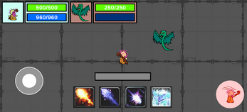

# GSP-Tech-Demo-3-Assessment-Project
Gameplay Systems Programming 3rd Tech Demo (2D Mobile RPG Combat System)

[

](https://www.youtube.com/embed/OLTB-zc04EA)

  

## Insights

First attempt at making a mobile game using pre-existing assets in Unity using C#. You can play the game here:
https://themglegends.itch.io/arcane-scales-wizards-quest

## Requirements

The following requirements have been fully completed.

1. Movement & Animation
2. Target System
3. Normal Attack System
4. Damage System
5. Death System
6. Aggro System
7. Buff System
8. HUD Design
9. Abilities (4)
10. Enemy

## Requirements Specifications

